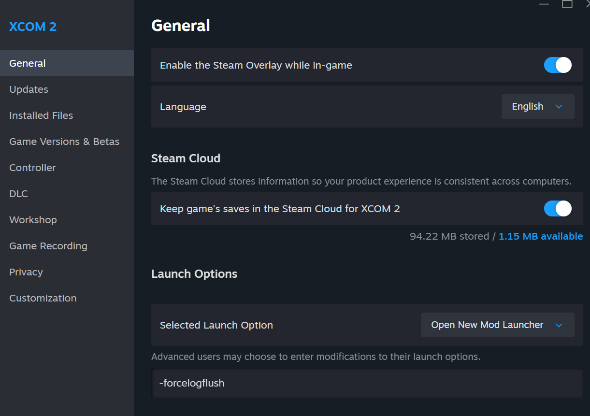

<p align="center">
  
</p>

<h1 align="center">Anarchy Radio FM</h1>

<p align="center">
  <strong>Your music. Your XCOM. Finally.</strong>
</p>

<p align="center">
  <a href="https://github.com/emzakit/xcom_anarchyfm/releases/latest">
    
  </a>
  <a href="https://steamcommunity.com/sharedfiles/filedetails/?id=3772839338">
    
  </a>
  <a href="LICENSE">
    
  </a>
</p>

<p align="center">
  <a href="https://youtu.be/y4coRhi1n3w">
    
  </a>
</p>

<p align="center">
  <a href="https://youtu.be/y4coRhi1n3w"><strong>Watch me in action</strong></a>
</p>

---

## 📡 Incoming transmission

There's a van out in the Wilderness. It shouldn't run. ADVENT would very much like to know where it is. Inside, two absolute liabilities called **JAX** and **SILO** are running an unlicensed radio station off gear that fell out of the back of a supply truck, and neither of them has once stopped talking long enough to notice they're broadcasting straight into a warship full of Commanders.

They have no idea XCOM is listening. Nobody's told them. Nobody's going to.

Here's what Command's been feeding you: a lovely orchestral score, extremely tasteful, and — forty hours in — extremely the same. This is the pirate signal underneath it, and unlike ADVENT's propaganda channel, **this one takes requests.**

- 🎻 **Hans Zimmer** narrating the Geoscape while the planet quietly loses? Sure, why not.
- 🤘 **Slipknot** the exact moment a Sectoid pops out of the dirt? Obviously.
- 💃 **The Spice Girls** over an ADVENT ambush, purely because you thought it'd be funny six hours ago and it's now permanently canon? Not our place to stop you.

We've got eyes on your squad, Commander, and frankly they deserve better than the same string section on loop.

**Anarchy Radio FM rips out XCOM 2's soundtrack and lets you put anything back in.** Drop files into folders. Each screen gets its own playlist. That's the whole pitch.

> No conversions. No file renaming. No ffmpeg gymnastics. No `.upk` file the size of a small, angry moon. **Files, folders, an exe. Done.**

---

## 🚀 Get it running (four steps, Commander)

**1.** Subscribe to **[the mod](https://steamcommunity.com/sharedfiles/filedetails/?id=3772839338)**
and **[Music Modding System](https://steamcommunity.com/workshop/filedetails/?id=757398474)**.

> Both, not one. MMS's entire job is making the game's own soundtrack shut up; ours is playing yours instead. Skip MMS and you get two DJs fighting over the same microphone.

**2.** Add **`-forcelogflush`** to XCOM 2's launch options.

> Skip this one and your music barges straight over every cinematic, uninvited, like it owns the place. **Do the step. Trust us on this.**

<details>
<summary><strong>Show me exactly where →</strong>&nbsp; (Steam, and the Alternative Mod Launcher)</summary>

<br>

**Steam** — right-click **XCOM 2 → Properties → General → Launch Options**, and
type it into the box at the bottom.

<table>
<tr>
<td width="50%"></td>
<td width="50%"></td>
</tr>
</table>

**Alternative Mod Launcher** — **Options → Settings → Active arguments**. Stick
it on the **end** of whatever's already in there. That existing text is doing a
job — don't wipe it out to make room.

<table>
<tr>
<td width="50%"></td>
<td width="50%"></td>
</tr>
</table>

</details>

**3.** **[Download the app](https://github.com/emzakit/xcom_anarchyfm/releases/latest)**,
unzip it wherever, **run the exe.** A setup wizard does the tedious part so you don't have to.

**4.** Drop your music into the folders it builds for you. **That's it.** Go make some noise.

<p align="center">
  
</p>

> **☝️ Coming from v2.2 or earlier?** Turn XCOM's Music volume **back up**
> (*Options → Audio*). Zeroing it out used to be the only fix for the game's
> own soundtrack bleeding through — that bug's dead now, and leaving the
> slider at zero also gags MMS and every music pack you're running. Free the sliders.

---

## 📻 The good bit: Radio Mode

One button. The Avenger tunes into a station, and **every single track drops you in at a random point** — like the broadcast has been running the whole time and you just wandered into the room mid-sentence.

**Try this:** find yourself an hour-long **GTA radio station rip** — DJ banter, fake adverts, all of it — and load it in. Every trip back to the ship lands you somewhere new: mid-song, mid-ad break, mid-rant about an energy drink that is legally, definitely, not Monster.

Or subscribe to our own daft little XCOM podcast and switch it on under music addons:

https://steamcommunity.com/sharedfiles/filedetails/?id=3775888357

Good fun, and it shows you exactly what this thing can do. *Vigilo Confido.*

[**→ Radio Mode in full**](https://github.com/emzakit/xcom_anarchyfm/wiki/Features#radio-mode)

---

## 🎁 What else is in the crate

<table>
<tr>
<td width="42%"></td>
<td>

### 🎚️ Effects

Radio filter, reverb, bass, chorus, bitcrush, echo — per screen, with presets ready to go.

Want the Avenger sounding like a field radio held together with tape, hope, and a war crime? **Two clicks.**

**[Effects and per-state settings →](https://github.com/emzakit/xcom_anarchyfm/wiki/Features#the-buttons)**

</td>
</tr>
<tr>
<td width="42%"></td>
<td>

### 🎧 Spotify *(experimental, and entirely your call)*

Pin a Spotify playlist to each screen. Genuinely works well — different moods for creeping around versus everything going up in flames.

Needs Premium, the desktop app open, and **your own API keys**. It runs on *your* account under *your* registration, on purpose.

**[Set up Spotify →](https://github.com/emzakit/xcom_anarchyfm/wiki/Spotify-setup)**

</td>
</tr>
<tr>
<td width="42%"></td>
<td>

### 📦 Music Addons

Subscribe to a Workshop music pack and it **just shows up** in your library. Flip packs on and off, sort by genre, and nothing gets copied onto your drive.

No mod launcher wrangling required. The app goes and finds them itself — a Skyranger that's actually on schedule for once.

**[Music Addons →](https://github.com/emzakit/xcom_anarchyfm/wiki/Features#music-addons)**
· **[Make your own →](https://github.com/emzakit/xcom_anarchyfm/wiki/Making-a-music-pack)**

</td>
</tr>
</table>

Also on tap: **self-updating** — it parks your old version in its own folder next to the new one, so rolling back is drag-and-drop, not a rescue op — plus **per-screen everything**: volume, looping, random start, all remembered exactly as you left it.

---

## 🎙️ The comms log isn't a status readout

It's the station.

```
SILO: No carrier yet. We're just talking to ourselves out here.
JAX : WE ARE LIVE. Anarchy FM, broadcasting from a van that is definitely on fire.
JAX : SILO, cut state_mission_explore. We're going to state_mission_combat. 3 ready.
SILO: Carrier's gone. Killing the transmitter before ADVENT triangulates us. Again.
```

**SHEN** runs setup and tells you straight when something's genuinely on fire — she knows you're out there listening. **JAX** (decks) and **SILO** (wire) do not, and never will, no matter how much they overshare.

Every line they say lives in **one editable file** inside the app folder. Don't rate the crew? Fire the lot of them and write your own. No code required.

---

## 📚 The Codex

Everything past "run the exe" lives in the
**[wiki](https://github.com/emzakit/xcom_anarchyfm/wiki)**.

|   |   |   |
|---|---|---|
| 📂 | [Using the music folders](music/music_readme.md) | Which folder scores which screen |
| ✨ | [Every feature, in detail](https://github.com/emzakit/xcom_anarchyfm/wiki/Features) | The full tour |
| 🔧 | [Something's wrong](https://github.com/emzakit/xcom_anarchyfm/wiki/Troubleshooting) | Two soundtracks, no music, known gremlins |
| 🛠️ | [Making your own music pack](https://github.com/emzakit/xcom_anarchyfm/wiki/Making-a-music-pack) | Publish one to the Workshop |
| ⚙️ | [How it works](https://github.com/emzakit/xcom_anarchyfm/wiki/How-it-works) | And running it from source |
| 🔨 | [Building the exe](https://github.com/emzakit/xcom_anarchyfm/wiki/Building-the-exe) | Compile it yourself, trust nobody |
| 📝 | [Changelog](https://github.com/emzakit/xcom_anarchyfm/wiki/Changelog) | What changed, and when |

---

## ⚠️ Mission briefing: the honest bit

Every mod page promises the moon. Here's what you actually get.

**✅ The Avenger and Squad Select are the polished bits.** That's where the hours went, and I'll defend them without blinking.

**🚧 The tactical side is beta.** Occasionally it trips — an overlap, the wrong mood cue, timing that lands like a rookie freezing on turn one. It's good. It is not flawless, and I won't tell you otherwise.

**🤝 Running an MMS music pack alongside this** works properly as of v2.3. Fill the folders you actually care about; the pack quietly covers everything else. Very occasionally one screen plays your music one session and the pack's the next — flip that toggle off in the app and the pack wins, every time, no argument.

**Running LWOTC** should be fine, although there might be some things I haven't seen yet. Please report issues!

**[Known issues →](https://github.com/emzakit/xcom_anarchyfm/wiki/Troubleshooting#known-issues)**

> **🛡️ Scanner flagged the exe?**
> [False alarm](https://github.com/emzakit/xcom_anarchyfm/wiki/Troubleshooting#flagged-as-a-virus).
> PyInstaller stuffs an entire Python runtime into a single exe, which to an antivirus
> looks **exactly** like what actual malware does — same wrapping paper, wildly
> different contents. Textbook mistaken identity. Don't trust a stranger's
> binary? Fair instinct. [Build it yourself.](https://github.com/emzakit/xcom_anarchyfm/wiki/Building-the-exe)

---

## 🏅 Credits

Three years in the making, and the follow-up to my
**[Resistance Radio](https://steamcommunity.com/sharedfiles/filedetails/?id=2863096697)**
mod. Built squarely on the shoulders of
**[Music Modding System](https://steamcommunity.com/workshop/filedetails/?id=757398474)** —
none of this exists without it. Genuinely. Go thank them.

Open source because everything should be, and partly in the hope some XCOM
wizard smarter than me works out how to do this *inside* Unreal instead of
strapping an external audio player to the side of it. That's the real dream.
I got close. I did not get there.

Both mods are mine — **emzakit (Moondear)**. MIT licensed, see [`LICENSE`](LICENSE).

**Now go make the Avenger sound like *yours*, Commander.**

<p align="center">
  <a href="https://youtu.be/y4coRhi1n3w">Watch it</a>
  &nbsp;·&nbsp;
  <a href="https://github.com/emzakit/xcom_anarchyfm/releases/latest">Download</a>
  &nbsp;·&nbsp;
  <a href="https://steamcommunity.com/sharedfiles/filedetails/?id=3772839338">Steam Workshop</a>
  &nbsp;·&nbsp;
  <a href="https://github.com/emzakit/xcom_anarchyfm/issues">Report a bug</a>
</p>
