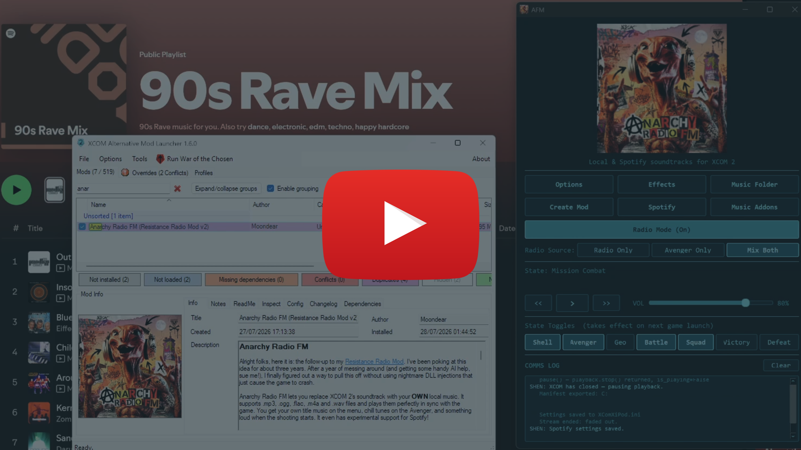
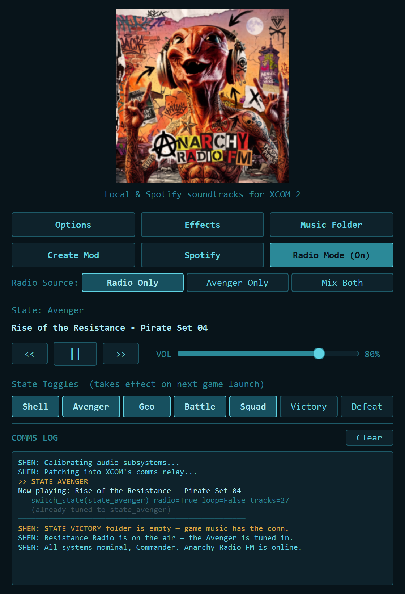
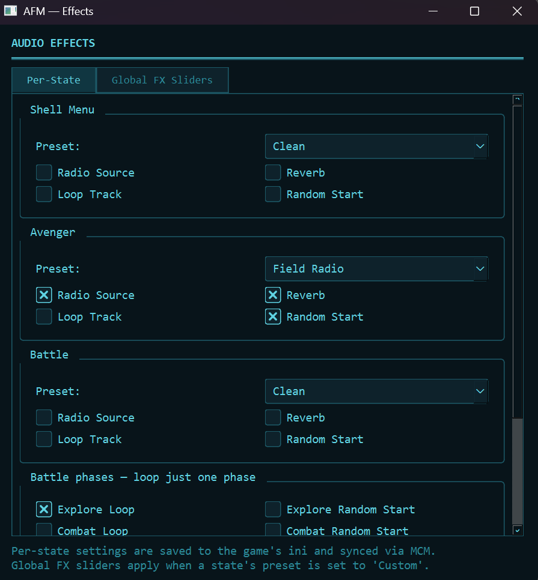
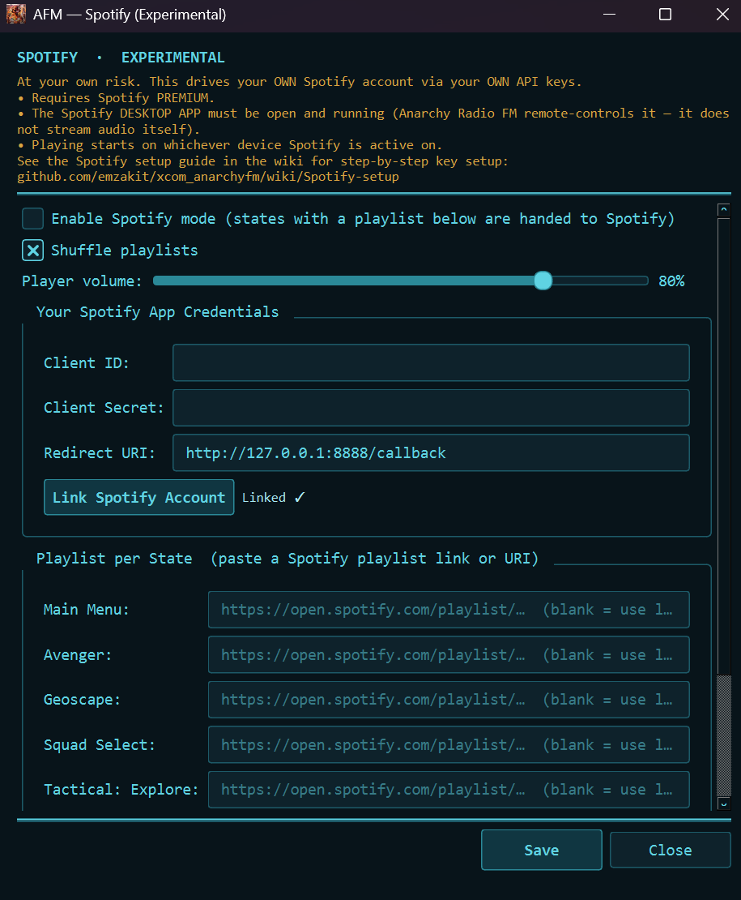
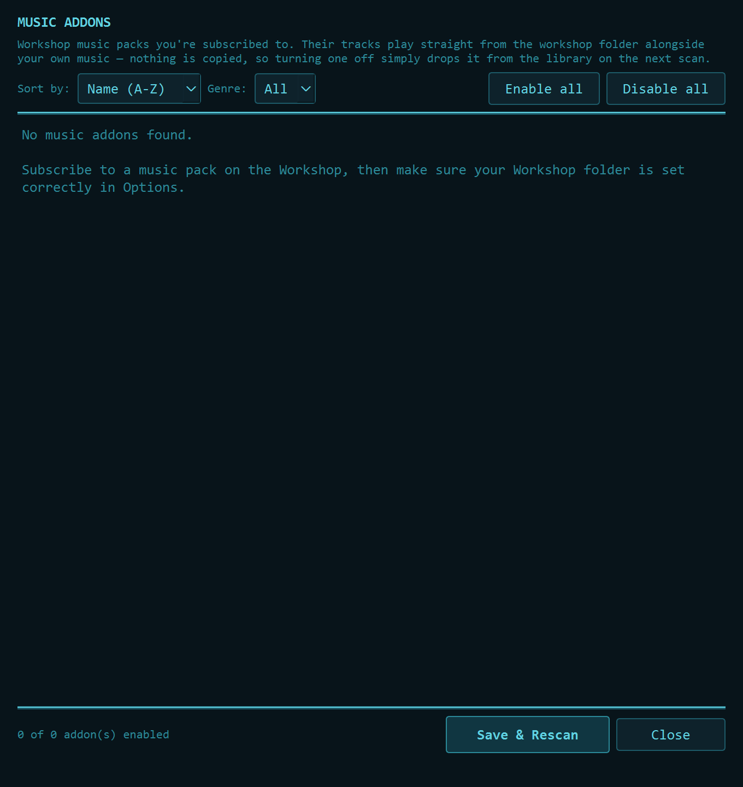

<p align="center">
  
</p>

<h1 align="center">Anarchy Radio FM</h1>

<p align="center">
  <strong>Replace the soundtrack of XCOM 2 with your own music.</strong>
</p>

<p align="center">
  <a href="https://github.com/emzakit/xcom_anarchyfm/releases/latest">
    
  </a>
  <a href="https://steamcommunity.com/sharedfiles/filedetails/?id=3772839338">
    
  </a>
  <a href="LICENSE">
    
  </a>
</p>

---

<p align="center">
  <a href="https://youtu.be/y4coRhi1n3w">
    
  </a>
</p>

<p align="center">
  <a href="https://youtu.be/y4coRhi1n3w"><strong>Watch me in action</strong></a>
</p>

---

Anarchy Radio FM is a little desktop app that plays your own `.mp3` / `.ogg` /
`.wav` / `.flac` / `.m4a` / `.opus` files in sync with the game — title music on the menu, chill tunes on the Avenger,
something loud when the shooting starts. It quietly watches XCOM 2's log, notices
when the game changes screens, and plays the right tracks from folders on your
PC while the game's own music gets muted (through MMS). That's the whole trick.

It is a follow up to my
**[Resistance Radio](https://steamcommunity.com/sharedfiles/filedetails/?id=2863096697)**
mod. 3 years in the making and it's finally here.

I'm making this open source because everything should be (especially if AI helps out) and also in case one of you XCOM gurus figures out a way to make it work within the Unreal Engine itself and doesn't require an external Python audio player. That's the real dream, but I couldn't quite pull it off. Maybe one of you will.

The heart of it is having **your own music on the Avenger and Squad Select**. This is the part that works properly, and it's where the vast majority of the effort went.
Everything else is a fun bonus that's still finding its feet.

## Quick links

|     |                                                                                                                     |
| :-- | :------------------------------------------------------------------------------------------------------------------ |
| 📥  | **[Download the latest release](https://github.com/emzakit/xcom_anarchyfm/releases/latest)**                        |
| 🎮  | **[Subscribe on the Steam Workshop](https://steamcommunity.com/sharedfiles/filedetails/?id=3772839338)** — required |
| 🎼  | [Music Modding System](https://steamcommunity.com/workshop/filedetails/?id=757398474) — required                    |
| 🚀  | [Alternative Mod Launcher](https://github.com/X2CommunityCore/xcom2-launcher) — recommended                         |
| 📂  | [How to use the music folders](music/music_readme.md)                                                               |
| 🎧  | [How to set up Spotify](SPOTIFY_SETUP.md)                                                                           |
| 🛠️ | [How to make your own music pack](addon_template/MODDING_GUIDE.md)                                                  |
| 🔨  | [How to build the executable yourself](BUILDING.md)                                                                 |
| 📝  | [Changelog](CHANGELOG.md)                                                                                           |

## Contents

- [Things to watch out for](#things-to-watch-out-for)
- [Alright, here's how it works](#alright-heres-how-it-works)
- [What you'll need](#what-youll-need)
- [Getting it running](#getting-it-running)
- [Adding your music](#adding-your-music)
- [Resistance Radio mode](#resistance-radio-mode-the-good-stuff)
- [The buttons](#the-buttons)
- [Spotify per state](#spotify-per-state-experimental--your-keys-your-risk)
- [Music Addons](#music-addons--workshop-music-packs)
- [Staying up to date](#staying-up-to-date)

## Things to watch out for

The tactical side (combat, explore, geoscape, the victory/defeat stingers,
cinematic handling) is **beta**. It works most of the time, but it *will* trip
occasionally: a track overlapping, the wrong mood playing, a beat of awkward
timing.

If what you really want is a bulletproof full-game soundtrack, you'll be
happier grabbing a music pack and running it straight through MMS. Think of
Anarchy Radio FM's combat stuff as "ooh neat" rather than "rock solid."

I made this as a companion to MMS specifically so that you can have the two running at the same time and cover the gaps that this system fails at, it is not a **replacement.**

> **One thing that's not optional:** Anarchy Radio FM is an **add-on to MMS, not a
> replacement.** The
> [Music Modding System (MMS)](https://steamcommunity.com/workshop/filedetails/?id=757398474) does the
> heavy lifting of silencing the game's built-in music, and Anarchy Radio FM leans on it to
> work at all. **Install and enable MMS first** — nothing here works without it.

> **Turn XCOM's own Music volume down to 0.** In game: **Options → Audio →
> Music**. MMS silences most of the game's soundtrack for you, but not every
> screen and not every moment — and the gaps are exactly where you'll hear two
> soundtracks fighting each other. This one setting prevents most of the
> "weird audio" reports.
>
> *(No, the app can't do it for you. XCOM stores audio settings in a binary
> profile save that also holds your character pool — not something worth
> writing to on your behalf.)*

---

## Alright, here's how it works

<p align="center">
  
</p>

There are two halves, and they gossip through a log file:

1. **The in-game mod** (a tiny companion Workshop item) watches XCOM's screens
   and scribbles the current state (`XIPOD: STATE_AVENGER`, and friends) into the
   game's `Launch.log`. It also slots *silent* cues into MMS so the game hushes
   its own music for that state.
2. **This app** keeps an eye on that log, and the moment the state changes it
   fades into a shuffled pick of your local tracks for that screen — crossfades,
   optional effects, the works.

Nice side effect of doing the audio in a separate process: a dodgy file can't
take the game down with it. Worst case, Anarchy Radio FM shrugs and skips that one track.

There are two ways to organise your music, and you can mix them: drop tracks
into the **per-state folders** (`STATE_AVENGER/`, `STATE_GEOSCAPE/`, …) so each
screen gets its own music, or put everything in **`STATE_RESISTANCE_RADIO/`**
and run it as one station with the **Radio Mode** button. More on that below.

<p align="center">
	
</p>

---

## What you'll need

- **XCOM 2 or XCOM 2 War of the Chosen** - only tested on Windows version.
- **[Music Modding System (MMS)](https://steamcommunity.com/workshop/filedetails/?id=757398474)** — the
  in-game music framework. Required, and enabled in your mod list.
- **[The Anarchy Radio FM in-game mod](https://steamcommunity.com/sharedfiles/filedetails/?id=3772839338)** — the companion Workshop item that tells the app what
  the game's up to.*

Recommended: [Alternative Mod Launcher](https://github.com/X2CommunityCore/xcom2-launcher)

---

## Getting it running

Go to the release page, grab the zip file, unzip it somewhere and launch the .exe:
https://github.com/emzakit/xcom_anarchyfm/releases

### I want more control!

First off, you will need:

- **Python 3.10+** (built on 3.13).

That's it — **no ffmpeg install needed** any more. The decoder ships inside
the `av` package in `requirements.txt`, so `.mp3`, `.ogg`, `.flac`, `.m4a`,
`.opus` and friends all just play.

I've provided a lazy way via the **`launch.bat`**:

1. Install [Python](https://www.python.org/downloads/) — and *do* tick **"Add
   Python to PATH"** on the first screen, it saves a headache.
2. Grab this repo (download the ZIP or clone it).
```bash
git clone https://github.com/emzakit/xcom_anarchyfm.git
```
3. Navigate to the folder and use **`launch.bat`**.

First time through, `launch.bat` quietly sets up a virtual environment, installs
what it needs, and opens Anarchy Radio FM. After that it just launches straight away.

If you'd rather do it yourself:

```bash
python -m venv venv
venv\Scripts\activate
pip install -r requirements.txt
python src/main.py
```

Want it windowless, console only? Add `--cli`:

```bash
python src/main.py --cli
```

### The first-run wizard

On the very first launch a little setup wizard pops up. Just point it at:

- **Game launcher / .exe** — either `XCom2.exe` or a mod launcher like the
  Alternative Mod Launcher (AML). Anarchy Radio FM launches it for you and bows out when the
  game closes.
- **Music library folder** — wherever you want your tunes to live. Anarchy Radio FM builds
  all the `STATE_*` folders inside it for you.
- **Workshop folder** *(optional)* — lets Anarchy Radio FM auto-import community music packs.
- **Game config folder** — usually auto-detected; it's where Anarchy Radio FM writes the MMS
  "shush" overrides.

Everything gets saved to `xipod_config.json` (stays on your machine, never
committed — peek at `xipod_config.example.json` if you're curious about the
shape). Changed your mind later? Re-run the wizard any time with
`python src/main.py --setup`.

---

## Adding your music

Drop audio files into whichever state folder you want to score:

| Folder | Plays during |
|--------|--------------|
| `STATE_SHELL_MENU/` | Main menu / title screen |
| `STATE_AVENGER/` | Avenger base interior |
| `STATE_GEOSCAPE/` | Geoscape / hologlobe |
| `STATE_SQUADSELECT/` | Squad select (pre-mission) |
| `STATE_MISSION_EXPLORE/` | Tactical: creeping around, nobody shooting yet |
| `STATE_MISSION_COMBAT/` | Tactical: it's kicking off |
| `STATE_VICTORY/` | Post-mission victory sting |
| `STATE_DEFEAT/` | Post-mission "well, that went badly" sting |
| `STATE_RESISTANCE_RADIO/` | The radio station pool — random-start, Avenger only (the fun one) |

Every state also has a `_LOOP` twin (`STATE_AVENGER_LOOP/`, etc.) for tracks you
want to loop rather than shuffle through. Leave a folder empty and Anarchy Radio FM just
steps aside, letting the game's own music play for that screen. The full
rundown — plus how to package up shareable Workshop music packs — lives in
**[`addon_template/MODDING_GUIDE.md`](addon_template/MODDING_GUIDE.md)** and **[`music/music_readme.md`](music/music_readme.md)**.

---

## Resistance Radio mode (the good stuff)

If you try one thing, try this. Hit the **Radio Mode** button and the Avenger
tunes into a station — with a lovely little twist: **every track starts from a
random spot.** Like the broadcast was already running and you just tuned in
mid-song. Nothing ever kicks off from the top, so it never feels like a
playlist looping round the block; it feels like an actual *broadcast* you're
ducking in and out of while you potter around the ship.

**Want to *get it* in about thirty seconds?** Go download one of the **GTA radio
stations** — they're long, unbroken mixes with DJ banter, fake adverts, the whole
vibe. Drop one into `STATE_RESISTANCE_RADIO/`, switch Radio Mode on, and every
time you come back to the Avenger you'll land somewhere new in the broadcast:
mid-track, mid-advert, mid-DJ-ramble. It just *clicks*.

> Pro tip: long files really shine here. A 30–60 minute station mix gives that
> random start loads of room to roam. Short single tracks work fine too, but the
> "always live" magic is strongest with big, continuous audio.

### Avenger only — on purpose

Radio Mode applies to **the Avenger and nowhere else.** Every other screen is
left completely alone.

That's deliberate. Long-form radio is downtime atmosphere: it's perfect while
you're wandering the ship, and actively bad everywhere else. On the main menu
it fights the game's own music, and having a DJ crack a joke halfway through a
firefight torpedoes the tension. So the button stays where it works.

### Radio Source — three ways to use it

With Radio Mode on, three buttons decide where the Avenger pulls from:

| Button | What plays |
|---|---|
| **Radio Only** | `STATE_RESISTANCE_RADIO/` only *(falls back to `STATE_AVENGER/` if it's empty)* |
| **Avenger Only** | `STATE_AVENGER/` only — your normal Avenger tracks, but with the random start points |
| **Mix Both** | Both folders pooled — when a track finishes, the next can come from either |

**Avenger Only** is the sleeper hit here: it gives your existing Avenger music
the "tuned in mid-song" treatment without needing a radio folder at all.

- **Off by default**, but once you turn it on it stays on — the switch and
  your Radio Source choice are remembered between sessions.
- **It overrides `STATE_AVENGER_LOOP/`.** While Radio Mode is on, the loop
  folder is skipped and the Loop Track setting is ignored — a station that
  replays one track forever isn't a station. Switch Radio Mode off and your
  loop track comes straight back.
- **Station length** (Options, or the setup wizard): Radio Mode loads a slice
  at a time rather than a whole file, then re-tunes to a fresh random spot.
  Hour-long rips would otherwise cost a few hundred MB and a long pause before
  the first note — 10 minutes gets you playing in about two seconds. Set it to
  0 to always play tracks to the end.
- Your per-state **Radio Source checkboxes in Effects are left alone.** Those
  still work on any state, independently of this button, for anyone who wants
  radio content elsewhere.

**Changing stations, the lazy way:** there's no in-game menu to fiddle with — to
skip to something new, just **dip in and out of the Geoscape** and back, exactly
like the original Resistance Radio. Each round-trip reshuffles and drops you at
a fresh random spot — basically retuning the dial. (If you'd rather have
buttons, the in-game mod also ships `XiPodPlay` / `XiPodPause` / `XiPodNext` /
`XiPodPrev` console commands you can bind to keys.)

---

## The buttons

- **Transport** — play/pause, next/previous, and a master volume slider.
- **State toggles** — flip Anarchy Radio FM on or off per state. Switch one off and MMS
  hands the game's own music back for that screen. *(Heads-up: toggle changes
  land on the **next** game launch, since XCOM only reads its config at startup.)*
  Toggles, volumes and effects are **saved to `XComXiPod.ini`** and come back
  next time — they're also what the in-game MCM menu reads, so the two stay in
  step. *(Before v2.2.0 they quietly reverted on every launch.)*
- **Options** — tweak your configured paths.
- **Effects** — per-state presets and FX (radio filter, reverb, bass, chorus,
  bitcrush, echo), plus loop / random-start switches.
- **Create Music Mod…** — spins up a ready-to-fill Workshop music-pack project.
- **Spotify** *(experimental)* — more below.
- **Music Addons** — turn subscribed Workshop music packs on and off. More below.
- **Radio Mode** *(+ Radio Source)* — tune the Avenger to a station. More below.
- It tucks into the system tray while you play. **Close XCOM and the music
  pauses straight away** — then it waits around in case you relaunch from your
  mod launcher, and shuts itself down once that closes too.

---

## Spotify per state (experimental — your keys, your risk)

<p align="center">

</p>

Here's a spicy one: pin a **Spotify playlist to each game state** — a combat
playlist for combat, something mellow for the Avenger, and so on. It's
**experimental** and very much **at your own risk**, because it runs on *your*
Spotify account through *your own* API app.

**Read this bit before you get excited:** Spotify's API can't actually stream
audio — it can only **remote-control a Spotify app that's already open**. So what
Anarchy Radio FM really does is nudge your **Spotify desktop app** onto the right playlist
when the game changes state. Which means:

- **You need Spotify Premium** (controlling playback is a Premium-only thing).
- **The Spotify desktop app has to be open and running.**
- You bring your **own** Client ID / Secret from the Spotify Developer Dashboard.
  They live **only on your machine** (git-ignored) — guard the secret like a
  password.

Leave any state blank and it happily falls back to your local files, so you can
mix and match — Spotify for the base, local tracks for combat, whatever you fancy.
The full walkthrough (making the app, grabbing the keys, linking your account) is
in **[`SPOTIFY_SETUP.md`](SPOTIFY_SETUP.md)**, and there's a **Spotify** button
in Anarchy Radio FM that opens it all up.

---

## Music Addons — Workshop music packs

<p align="center">

</p>

If someone decides to make a music addon for this, you will be able to subscribe to a music pack on the Workshop and it just turns up. The **Music
Addons** button lists everything you're subscribed to, with its author, genre
tags, description and how many tracks it's contributing — and a switch to turn
each one on or off.

**Nothing is copied to your drive.** Addon tracks play straight out of the
workshop folder where Steam put them, mixed in alongside your own music. That's
deliberate: a station-rip pack can run to gigabytes, and once files are copied
into your music folder there's no way to tell them apart from your own — so
there'd be no way to turn a pack back off.

- Sort by name, genre or track count, and filter to a single genre.
- **Enable all / Disable all** for quickly A/B-ing a new pack.
- **Save & Rescan** applies changes immediately — no restart.
- Your own music always wins a filename collision, so a pack can never
  shadow a track you put there yourself.

### Making your own

Hit **Create Mod**, give it a name, and you get a complete ready-to-publish
ModBuddy project — solution, project file, Config INIs, DLC class, all fifteen
`music/STATE_*` folders and a filled-in descriptor. Drop your audio in, edit
the JSON, publish. Full walkthrough in
**[`addon_template/MODDING_GUIDE.md`](addon_template/MODDING_GUIDE.md)**.

---

## Staying up to date

From v2.2.0 the app checks GitHub for new releases when it starts, shows you
the release notes, and can install the update itself — download, verify, swap,
relaunch. No hunting for the zip.

- **It never touches your stuff.** The update copies the new files over the
  old ones; it never mirrors or deletes. `xipod_config.json`,
  `xipod_presets.json` and `.spotify_cache.json` are explicitly excluded, so
  your settings survive — as does a music library kept next to the exe.
- Downloads are pulled **only** from this repo's GitHub releases over HTTPS,
  and the zip is checked for the right size and the right contents before
  anything is copied.
- Don't want it? Untick **Check for updates when Anarchy Radio FM starts** in
  the update window. Dismiss a version and it won't ask about that one again.
- Running from source? It'll tell you there's a new version and leave the
  updating to `git pull`.

---

## What happened to the Web Player? (removed in v2)

Earlier versions had a **Web Player** — a browser embedded in the app for
streaming YouTube. It's gone, and it isn't coming back. Three reasons:

- **It was 360 MB of the download.** The embedded browser was QtWebEngine, a
  full private copy of Chromium: a 195 MB DLL, 101 MB of resources and 44 MB
  of locale files, all so you could look at one web page.
- **Shipping a second browser is a security liability.** A bundled Chromium
  is a browser engine that updates when *we* remember to update it, not when
  Google ships a patch. That's a lot of attack surface to hang off a music
  mod, and it's not surface anyone asked for.
- **The replacement wasn't good enough.** We tried binding YouTube playlists
  to game states through YouTube's official embedded player. It technically
  worked, but uploaders block embedding constantly, and anyone without
  Premium got advert breaks mid-mission. Not a soundtrack.

If you want streaming per state, **Spotify** does it properly, because there
the desktop app does the playing and we just point it at a playlist. For
everything else, local files and Radio Mode are what this app is actually
good at.

---

## What's in the box

| Path | What it is |
|------|-----------|
| `src/` | The app itself (audio engine, log watcher, GUI, Spotify control, music addons, updater, setup, MMS config writer) |
| `addon_template/` | ModBuddy template + guide for building your own music packs |
| `tests/` | Unit + integration tests (`python -m unittest discover -s tests`) |
| `SPOTIFY_SETUP.md` | Step-by-step for the experimental Spotify hook-up |
| `music/` | Your music library — ships as empty `STATE_*` folders ready to fill |
| `launch.bat` | The one-click launcher (sets the venv up on first run) |
| `requirements.txt` | Python dependencies |
| `xipod_defaults.json` | Built-in presets, INI defaults, and cinematic timing data |
| `xipod_config.example.json` | A template for the per-user config |
| `CHANGELOG.md` | What changed, and when |

---

## Status & credits

Beta, and proudly so — provided as-is. **Avenger and Squad Select are the
polished bits I actually stand behind; everything else is experimental, so for a
watertight full soundtrack, reach for an MMS music pack.**

Built on the shoulders of the **[Music Modding System (MMS)](https://steamcommunity.com/workshop/filedetails/?id=757398474)** — none of this
happens without it. Anarchy Radio FM and the original
**[Resistance Radio](https://steamcommunity.com/sharedfiles/filedetails/?id=2863096697)**
are both mine, **emzakit (Moondear)**. 

Released under the MIT License —
see [`LICENSE`](LICENSE). Now go make the Avenger sound like *yours*.

<p align="center">
  <a href="https://youtu.be/y4coRhi1n3w">▶ See it in action</a>
  &nbsp;·&nbsp;
  <a href="https://github.com/emzakit/xcom_anarchyfm/releases/latest">Download</a>
  &nbsp;·&nbsp;
  <a href="https://steamcommunity.com/sharedfiles/filedetails/?id=3772839338">Steam Workshop</a>
  &nbsp;·&nbsp;
  <a href="CHANGELOG.md">Changelog</a>
</p>
